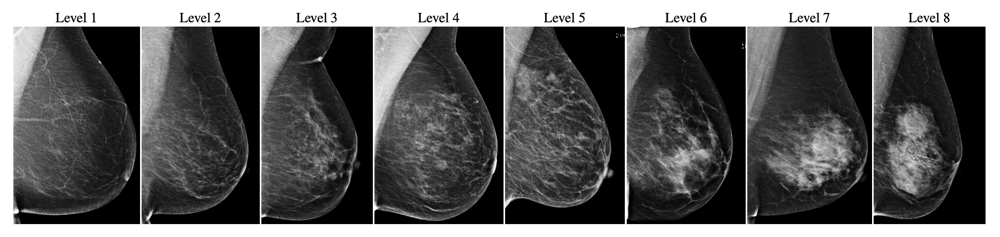

# CSAW-M

This repository contains code for [_CSAW-M: An Ordinal Classification Dataset for Benchmarking Mammographic Masking of Cancer_](https://arxiv.org/abs/2112.01330). Source code for training models to estimate the mammographic masking level along with the checkpoints are made available here.
The repo containing the annotation tool developed to annotate CSAW-M could be found [here](https://github.com/MoeinSorkhei/CSAW-M_Annotation_Tool). The dataset could be found [here](https://doi.org/10.17044/scilifelab.14687271).

<p align="middle">
  
</p>

---

### Training and evaluation

- In order to train a model, please refer to `scripts/train.sh` where we have prepared commands and arguments to train a model. In order to encourage reproducibility, we also provide the cross-validation splits that we used in the project (please refer to the dataset website to access them). `scripts/cross_val.sh` provides example commands to run cross-validation.
- In order to evaluate a trained model, please refer to `scripts/eval.sh` with example commands and arguments to evaluate a model.
- Checkpoints could be downloaded from [here](https://kth-my.sharepoint.com/:u:/g/personal/sorkhei_ug_kth_se/EQKgoJkRgv5SVHEPaVGLnWQBnmeAKWHLqCzPecz13pT1Cg?e=5BkByX).

---

**CSAW-M Dataset**

- The authors of the CSAW-M dataset have requested that we not share the files without their explicit permission. In order to keep with this request, we have provided intermediary files that obscure the original information(This is only necessary our class evaluations, durring actual submissions to conferences the dataset can be requested at: https://figshare.scilifelab.se/articles/dataset/CSAW-M_An_Ordinal_Classification_Dataset_for_Benchmarking_Mammographic_Masking_of_Cancer/14687271)
- In the original CSAW-M dataset, the data is pre-split into test and train sets. To keep inline with their tests, we used the same test and train files.

---

### Other notes

- It is assumed that `main.py` is called from _inside_ the `src` directory.

### Citation

If you use this work, please cite our paper:

```
@article{sorkhei2021csaw,
  title={CSAW-M: An Ordinal Classification Dataset for Benchmarking Mammographic Masking of Cancer},
  author={Sorkhei, Moein and Liu, Yue and Azizpour, Hossein and Azavedo, Edward and Dembrower, Karin and Ntoula, Dimitra and Zouzos, Athanasios and Strand, Fredrik and Smith, Kevin},
  year={2021}
}
```

---

### Questions or suggestions?

Please feel free to contact us in case you have any questions or suggestions!
